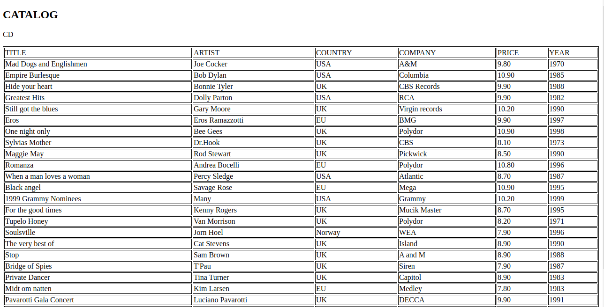

# XML to HTML converter
xml2html is a tool running on Linux. It converts an XML file to HTML file in a table format. See the example of the `output.html`. In browser the output file looks like this:


## Versioning
0.1

## Getting Started
These instructions will get you a copy of the project up and running on your local machine for development and testing purposes. See `Build` and `Run` for usage.  

### Prerequisites

GCC on Linux which supports C++ 17.

### Build
```
make
```
### Run
```
./xml2html <XML file name> <HTML file name>
```
For example,
```
./xml2html test/unit/cd_catalog.xml output.html
```
### Build clean
```
make clean
```
### run unit test
Unit test cases run . Ideally, the test coverage should be 100%. However, it is difficult to find a test framework to get the number.
```
make test
cd test/unit
./testSuite
```
If all test cases passed, the result should be like this:
```
===============================================================================
All tests passed (15 assertions in 8 test cases)
```
### run feature test
Feature test cases run the end to end test again the executable. Ideally ite is better to use a third pary feature test framework. However, I did not find a good framework. So I created a bash script to run the test.
```
cd test/features
./featureTest.sh
```
If all test cases passed, the result should be like this:
```
=================================================================
4 test case(s) passed.  0 test case(s) failed.
```
## Built With
* [pugixml](https://pugixml.org/docs/quickstart.html) - n open source library which can parse the input xml file. It consists of a DOM-like interface. It is in /src/lib/
* [Catch2](https://github.com/catchorg/Catch2/blob/v2.x/docs/tutorial.md) - a c++ unit test framework. It is in test/lib/

To choose third party libraries, the following should be considered first:
* License (MIT, Apache and ect): No one want to deal with legal issues.
* Good Reputation and Reviews
* Bug fix and upgrade: Make sure the author is still maintaining it.
* Document or Guide
* Stability: The library should run stable without any major issue.